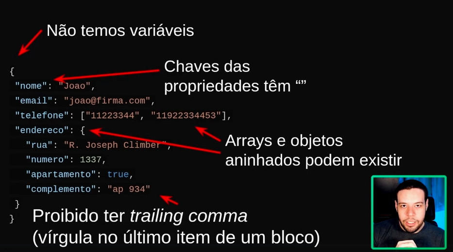

# Javascript: objetos

## Índice

- [Javascript: objetos](#javascript-objetos)
  - [Índice](#índice)
  - [O que são objetos?](#o-que-são-objetos)
  - [Acessando dados](#acessando-dados)
  - [Acessando dados com colchetes](#acessando-dados-com-colchetes)
  - [Adicionando e alterando](#adicionando-e-alterando)
  - [Para saber mais: tipos de variáveis e objetos](#para-saber-mais-tipos-de-variáveis-e-objetos)
  - [Para saber mais: como deletar uma propriedade?](#para-saber-mais-como-deletar-uma-propriedade)
  - [Tipos de dados e valores](#tipos-de-dados-e-valores)
  - [Objetos em objetos](#objetos-em-objetos)
  - [Lista de objetos](#lista-de-objetos)
  - [Funções](#funções)
  - [Para saber mais: objeto literal e referência](#para-saber-mais-objeto-literal-e-referência)
  - [for...in](#forin)
  - [Métodos de objetos](#métodos-de-objetos)
    - [Sintaxe de espalhamento](#sintaxe-de-espalhamento)
    - [Para saber mais: spread operator](#para-saber-mais-spread-operator)
    - [O formato JSON](#o-formato-json)
    - [Lendo um arquivo JSON](#lendo-um-arquivo-json)
    - [Operações com um JSON](#operações-com-um-json)
    - [Para saber mais: copiando objetos](#para-saber-mais-copiando-objetos)
    - [Encontrando um objeto](#encontrando-um-objeto)
    - [Filtando objetos](#filtando-objetos)
    - [Ordenando objetos](#ordenando-objetos)
    - [Ordenando ao contrário](#ordenando-ao-contrário)

## O que são objetos?

Objetos são estruturas que permitem organizar caracteristicas de algo de forma separada.

Por exemplo, ao invés de criar um array com nome, idade e cpf para determinada pessoa, podemos criar um objetoPessoa e atribuir essas informações à ela.

Código de exemplo:

```javascript
const objetoPessoa = {
    nome: "José",
    idade: 23,
    cpf: 1121313

}
```

## Acessando dados

Para acessar os dados de um objeto colocamos um ponto após o objeto e informamos o atributo desejado, por exemplo `objeto.nome`.

Abaixo um código de exemplo:

```javascript
// Criando objeto do tipo cliente
const cliente = {
    nome:"André",
    idade:32,
    cpf:"1111111111",
    email:"andre@gmail.com"
};

// Printando informações contidas no objeto
console.log(`O nome do cliente é ${cliente.nome} e a idade é ${cliente.idade}`);
console.log(`Os 3 primeiros dígitos do CPF são ${cliente.cpf.substring(0, 3)}`);
```

## Acessando dados com colchetes

Podemos acessar valores de objetos com colchetes ao invés do ponto. Isso é uma alternativa que facilita situações onde desejamos acessar todos os valores, inclusive valores que podem estar vazios dentro do objeto.

Abaixo um exemplo de código:

```javascript
// Criando objeto do tipo cliente
const cliente = {
    nome:"André",
    idade:32,
    cpf:"1111111111",
    email:"andre@gmail.com"
};

// Printando informações contidas no objeto
console.log(`O nome do cliente é ${cliente["nome"]} e a idade é ${cliente["idade"]}`);

// Por que existem 2 formas de acessar valores de objetos?
// Isso ocorre para facilitar acesso em momentos que não sabemos as chaves existentes

// Criando variavel com as chaves do objeto
const chaves = ["nome", "idade", "cpf", "email", "altura"];

// Varrendo objeto em busca dos valores de cada chave
// Para a chave "altura", o forEach vai retornar undefined
chaves.forEach((chave) => {
  console.log(`A chave ${chave} tem valor ${cliente[chave]}`);
});
```

## Adicionando e alterando

Para adicionar novos atributos ou alterar dados de algum atributo dentro de um objeto, podemos usar a estrutura `objeto.atributo = "valor_a_ser_preenchido`.

Mesmo que o objeto seja criado a partir de uma variável do tipo `const`, conseguimos alterar os atributos dentro dele. Isso ocorre porque variáveis `const` impedem apenas a mudança do escopo da variável, ou seja, a estrutura "pai" dela, o que não se aplica aos atributos contidos internamente.

Abaixo o código de exemplo:

```javascript
// Criando objeto pessoa
const pessoa = {
    nome: "Luma",
    profissao: "Engenheira"
};

// Printando nome
console.log(pessoa.nome);

// Tentando printar propriedade que não existe
console.log(pessoa.telefone); // retorna undefined

// Criando novo atributo e atribuindo um valor a esse atributo do objeto pessoa
pessoa.telefone = "11 12313141";

// Printando propriedade que passou a existir
console.log(pessoa.telefone);

// Mudando dado do atributo nome
pessoa.nome = "Luma Silva";

// Printando todo objeto pessoa
console.log(pessoa);


// -----------------------------

// Podemos editar variáveis constantes?
// Variáveis constantes não permitem modificar todo o conteúdo da variável, porém se quisermos mudar propriedades dentro do objeto não tem problema

// Criando novo objeto para exemplificar porque a const permite edição
const novaPessoa = {
    nome:"Pedro",
}

// Tentando atribuir ao objeto pessoa inicial esse novo objeto
pessoa = novaPessoa; // retorna erro
```

## Para saber mais: tipos de variáveis e objetos

Para saber mais sobre tipos de variáveis consultar o artigo [Entenda a diferença entre var, let e const no JavaScript](https://www.alura.com.br/artigos/entenda-diferenca-entre-var-let-e-const-no-javascript)

## Para saber mais: como deletar uma propriedade?

Para deletar os valores de uma propriedade podemos usar o comando `delete`, mas é importante lembrar que esse comando deleta a propriedade junto do valor que estiver dentro dela.

Exemplo:

```javascript
// Criando objeto de exemplo
const objPersonagem = {
    nome: "Gandalf",
    classe: "mago",
    nivel: "20",
    aliado: {
        nome: "Saruman",
        classe: "mago"
    },
    status: "desaparecido"
}

// Deletando tanto o valor quanto a propriedade com o comando delete
delete objPersonagem.aliado;

// Printando todo objeto
console.log(objPersonagem);
```

## Tipos de dados e valores

Dentro de um objeto podemos armazenar todos os tipos nativos do javascript (string, boolean, int), mas também alguns outros mais complexos, como por exemplo listas.

Listas são uteis em situações onde temos 2 ou mais informações muito similares e não desejamos criar um novo atributo para poupar cóoplexidade.

Exemplo:

```javascript
// Criando objeto com array de informações
const cliente = {
    nome: "Joao",
    idade: 24,
    email: "joao@firma.com",
    telefone: ["1155555550", "1311444441"],
};

// Printando objeto
console.log(cliente);
```

## Objetos em objetos

Podemos adicionar objetos dentro de outros objetos de forma aninhada da mesma forma que arrays. Isso ajuda a organizar o código em certas situações.

Exemplo:

```javascript
// Criando objeto com array de informações
const cliente = {
    nome: "Joao",
    idade: 24,
    email: "joao@firma.com",
    telefone: ["1155555550", "1311444441"],
};

// Adicionando ao objeto cliente um outro objeto do tipo endereço para deixar eles aninhados
cliente.endereco = {
    rua: "R. Joseph Climber",
    numero: 1234,
    apartamento: true,
    complemento: "Ap 901",
}

// Printando objeto cliente
console.log(cliente);

// Printando objeto endereço
console.log(cliente.endereco);

```

## Lista de objetos

Para deixar o código ainda mais funcional podemos criar listas de objetos. Isso é particularmente útil em situações do tipo que o cliente possui mais de um endereço e os dados de endereço são diversos.

Abaixo um exemplo:

```javascript
// Criando objeto com array de informações
const cliente = {
    nome: "Joao",
    idade: 24,
    email: "joao@firma.com",
    telefone: ["1155555550", "1311444441"],
};

// Adicionando uma lista de objetos (endereços) ao objeto pessoa
cliente.enderecos = [
    {
        rua: "R. Joseph Climber",
        numero: 1234,
        apartamento: true,
        complemento: "Ap 901",
    }
]

// Adicionando outro objeto à lista de objetos endereços
cliente.enderecos.push({
    rua: "R. Oswaldo Aranha",
    numero: 404,
    apartamento: false,
}
)

// Printando objeto cliente
console.log(cliente);

// Printando objeto endereço
console.log(cliente.enderecos);

//-------------------------

// Exemplo dos benefícios de se ter um array de objetos

//Criando uma variável que contem os endereços filtrados
const listaApenasApartamentos = cliente.enderecos.filter(
    (endereco) => endereco.apartamento === true // filtrando os que são apartamento e passando para lista
);

// Printando lista de apartramentos
console.log(listaApenasApartamentos);
```

## Funções

Um objeto também permite adicionar atributos do tipo function à eles, dessa forma podemos realizar operações com os valores dos objetos.

Abaixo um exemplo:

```javascript
// Criando objeto inicial
const cliente = {
    nome: "Joao",
    idade: 24,
    email: "joao@firma.com",
    telefone: ["1155555550", "1144444440"],
    saldo: 200,
    efetuaPagamento: function (valor) { // criando função para realizar compra
        if (valor > this.saldo) { // confirmando se valor da compra é abaixo do saldo
            console.log("Saldo insuficiente"); // printando mensagem de saldo insuficiente
        }
        else {
            this.saldo -= valor; // debitando valor
            console.log(`Pagamento realizado. Novo saldo: ${this.saldo}`); //printando mensagem de sucesso com novo saldo
        }
    }
};

// Chamando função do objeto cliente
cliente.efetuaPagamento(25);
```

## Para saber mais: objeto literal e referência

O JS trabalha com objetos da mesma forma que com arrays quando se trata de copiar informações (com notação literal), ou seja, se passar um objeto já criado para um novo objeto, o que acontece é que o JS vai direcionar o 2º objeto para a posição na memória do 1º.

Exemplo:

```javascript
// Criando obj personagem
const objPersonagem = {
    nome: "Gandalf",
    classe: "mago",
    nivel: "20"
}

// Criando novo objeto a partir do já criado
const objPersonagem2 = objPersonagem

// Mudando o nome do objeto personagem 2
objPersonagem2.nome = "Gandalf, o Cinzento"

// Printando ambos objetos para exemplificar saida
console.log(objPersonagem.nome) //Gandalf, o Cinzento
console.log(objPersonagem2.nome) //Gandalf, o Cinzento

// Ambos objetos retornam o mesmo valor, pois o JS apenas aponta os valores para a mesma posição na memória do computador
```

Como contornar isso? Usando o método `Object.create()` para criar um novo objeto.

Exemplo:

```javascript
// Para resolver esse problema criamos um objeto através do método object.create()

// Criando novo objeto a partir do anterior
const objPersonagem3 = Object.create(objPersonagem);

// Atribuindo novo valor ao nome do objeto criado
objPersonagem3.nome = "Gandalf, o Branco";

// Printando novas informações
console.log(objPersonagem.nome); //Gandalf
console.log(objPersonagem3.nome); //Gandalf, o Cinzento

```

## for...in

Podemos usar a propriedade `for...in` para varrer um objeto em busca das chaves contidas nele.

Dessa forma podemos pegar tanto o valor do atributo quanto o nome do atributo.

Abaixo um código de exemplo:

```javascript
// Criando objeto cliente
const cliente = {
    nome: "Joao",
    idade: 24,
    email: "joao@firma.com",
    telefone: ["1155555550", "1144444440"],
};

// Adicionando o endereço ao objeto cliente
cliente.enderecos = [
    {
        rua: "R. Joseph Climber",
        numero: 1337,
        apartamento: true,
        complemento: "ap 934",
    },
];

// Varrendo objeto cliente
for (let chave in cliente) { // Aqui estou varrendo cada "chave" (atributo) do objeto cliente
    let tipo = typeof cliente[chave]; // Criando variável para armazenar o tipo do atributo
    if (tipo !== "object" && tipo !== "function") { // Verificando se o atributo é tipo object ou function para remover do print
        console.log(`A chave ${chave} tem o valor ${cliente[chave]}`); // Printando tanto a chave (nome do atributo) quanto o valor contido nele
    }
}
```

## Métodos de objetos

O JS possui alguns métodos próprios de objetos que facilitam o trabalho com eles.

Dois exemplos são o método `includes` e o método `keys`, onde eles verificam se o objeto possui inclusão de determinado valor e verifica as chaves do objeto, respectivamente.

Exemplo:

```javascript
// Criando objeto cliente
const cliente = {
    nome: "Joao",
    idade: 24,
    email: "joao@firma.com",
    telefone: ["1155555550", "1144444440"],
};
cliente.enderecos = [
    {
        rua: "R. Joseph Climber",
        numero: 1337,
        apartamento: true,
        complemento: "ap 934",
    },
];

// Criando variável para conter as chaves do objeto cliente através do método KEYS próprio de objetos
const chavesDoObjeto = Object.keys(cliente);

// Printando chaves existentes dentro do objeto
console.log(chavesDoObjeto);

// Verificando se o objeto cliente não possui (!) um endereço incluído através do método INCLUDES que é próprio de objetos
if(!chavesDoObjeto.includes("enderecos")){ // Fazendo verificação
    console.error("Erro. É necessário ter um endereço cadastrado.") // Printando mensagem de erro caso o cliente não possua endereço
}
```

### Sintaxe de espalhamento

Podemos usar a sintaxe de espalhamento para distribuir valores de objetos dentro de uma função ou etc.

Isso é útil em situações onde precisamos de todos os dados de um objeto de forma separada, sem que sejam tratados como objetos, mas o objeto possui muitos atributos para serem passados manualmente.

Abaixo um exemplo:

```javascript
// Criando objeto cliente
const cliente = {
    nome: "Joao",
    idade: 24,
    email: "joao@firma.com",
    telefone: ["1155555550", "1144444440"],
};
cliente.enderecos = [
    {
        rua: "R. Joseph Climber",
        numero: 1337,
        apartamento: true,
        complemento: "ap 934",
    },
];

// Criando função para ligar para os 2 números contidos no array
function ligaParaCliente(telefoneComercial, telefoneResidencial) {
    console.log(`Ligando para ${telefoneComercial}`);
    console.log(`Ligando para ${telefoneResidencial}`);
}

// Usando o expalhamento para não precisar informar cada posição do array contendo os números
ligaParaCliente(...cliente.telefone);

// Criando variável para simular como seria passar cada campo do objeto cliente
const dadosParaEntrega = {
    destinatario: cliente.nome, // passando nome do cliente
    rua: cliente.enderecos[0].rua, // passando rua que está dentro do objeto que está no array de endereços na posição 0
    numero: cliente.enderecos[0].numero, // passando numero que está dentro do objeto que está no array de endereços na posição 0
    complemento: cliente.enderecos[0].complemento, // passando complemento que está dentro do objeto que está no array de endereços na posição 0
}

// Usando a mesma função do espalhamento para espalhar todos os dados contidos dentro do OBJETO endereço que está no do ARRAY de endereços, na posição 0.
const dadosParaEntrega2 = {
    destinatario: cliente.nome,
    ...cliente.enderecos[0],
}

// Printando dados para entrega 1
console.log(dadosParaEntrega);
// Printando dados para entrega 2
console.log(dadosParaEntrega2);
```

### Para saber mais: spread operator

Importante se atentar a certos detalhes no uso do `spread operator`.

> O espalhamento de objetos que possuam propriedades com o mesmo nome serão incrementados um encima do outro, ou seja, `se tentarmos criar um novo objeto pessoa onde passamos 2 pessoas diferentes que possuam o mesmo atributo, as informações do último objeto é que permanecerão`.
>
> Apesar de prático, o uso da sintaxe de espalhamento pode gerar bastante processamento, então devemos usar com cuidado, especialmente em `loops` e `funções recursivas`.

```javascript
// Criando objeto ficha guerreiro
const fichaGuerreiro = {
    nome: "Aragorn",
    classe: "guerreiro"
}
// Criando equipamento guerreiro
const equipoGuerreiro = {
    espada: "Andúril",
    capa: "capa élfica +2"
}

// Exemplo de criação de objeto literal
const guerreiro1 = { fichaGuerreiro, equipoGuerreiro }
console.log(guerreiro1)

// Exemplo de criação com spread operator
const guerreiro2 = { ...fichaGuerreiro, ...equipoGuerreiro }
console.log(guerreiro2)

// ------------------------

// Exemplo onde os objetos possuam chaves / propriedades com o mesmo nome

// criando objetos
const mago = {
    nome: "Gandalf",
    classe: "mago"
}
const guerreiro = {
    nome: "Aragorn",
    classe: "guerreiro"
}

const ranger = {
    nome: "Legolas",
    classe: "ranger"
}

// Passando todos as classes criadas
const personagens = { ...mago, ...guerreiro, ...ranger }
console.log(personagens) // O resultado será o último valor passado, pois o JS sobrescreve a cada ocorrência

```

Para mais detalhes desse funcionamento acessar [ES6 - Desestruturando objetos](https://www.alura.com.br/artigos/es6-desestruturando-objetos)

O JS também permite desestruturar objetos para poupar código na hora de trabalhar com atributos individuais.

Abaixo um código de exemplo:

```javascript
// Criando objeto fornecedor
const fornecedor = {
    razaosocial: "Alura - Cursos Online",
    cnpj: "00.000.000/0000-00",
    email: "suporte@alura.com.br"
};

// Criando variável a partir da propriedade razaosocial
const { razaosocial } = fornecedor;
console.log(razaosocial);

// --------------------------------------

// E se o objeto vier mal estruturado, sem nomes de atributos aparentes?

//Exemplo de objeto

const json = {
    a: "Matheus",
    b: "23",
    c: "matheushcastiglioni@gmail.com"
};

// Criando variáveis para cada um dos atributos do objeto
const { a: nome, b: idade, c: email } = json;
console.log(nome);
console.log(idade);
console.log(email);

// O código acima seria o mesmo que fazer

const nome1 = json.a;
const idade1 = json.b;
const email1 = json.c;
console.log(nome);
console.log(idade);
console.log(email);
```

Para saber como usar `destructuring` com arrays siga o video [Destructuring em JavaScript #AluraMais](https://www.youtube.com/watch?v=f8a-qwKC5yk)

### O formato JSON

O formato JSON (JavaScript Object Notation) é um formato que permite estrtuturar / escrever objetos JavaScript.

Arquivos JSON possuem uma certa similaridade com a construção de objetos em JS, mas não são 100% idênticos na estrutura.

Abaixo uma imagem de exemplo:


Lista de propriedades de um JSON:

- Não temos variáveis;
- Chaves das propriedades possuem "" para identificar;
- Arrays e objetos aninhados podem existir;
- Proibito ter `trailling comma` (vírguka no último item de um bloco)

- Funções não são permitidas;
- Comentários não são permitidos;
- Suporta apenas tipos primitivos (string, number, boolean, null) além de arrays e objetos aninhados



### Lendo um arquivo JSON

Para ler um arquivo JSON no JS podemos criar uma variável e passar para ela a função `require` nativa do JS, onde só precisamos passar o caminho do arquivo `.JSON` como argumento.

Abaixo um exemplo:

```javascript
// Criando variável para armazenar os dados do JSON
const dados = require("./exemplo.json");

// Printando conteúdo da variável dados
console.log(dados);

// Printando tipo da variável dados
console.log(typeof dados);
```

### Operações com um JSON

Dentro do JS existe um objeto global no Node que permite trabalhar com arquivos JSON.

Dois exemplos de funções que podem ser usadas são a `stringfy` e a `parse`, onde elas funcionam respectivamente para tornar um objeto em `string` e outra para "transformar" (parsear) uma variável `string para objeto`.

Abaixo um exemplo de código:

```javascript
// Criando variável para armazenar os dados do JSON
const dados = require("./exemplo.json");

// Printando conteúdo da variável dados
console.log(dados);

// Printando tipo da variável dados
console.log(typeof dados);

// -------------------------------------

// Usando a função stringify do objeto global JSON para transformar dados em string
const clienteEmString = JSON.stringify(dados);

// Printando nova variavel para exemplificar
console.log(clienteEmString);

// Printando tipo da nova variável
console.log(typeof clienteEmString);

// Como a nova variável é uma string, ela não permite operações de objetos, como abaixo
console.log(clienteEmString.nome); // retorna undefined

// --------------------------------------

// Para transformar a nova variável em objeto novamente podemos usar outra função do JSON
const objetoCliente = JSON.parse(clienteEmString);

// Printando informação da variavel objetoCliente 
console.log(objetoCliente);

// Printando tipo da variável objetoCliente
console.log(typeof objetoCliente);
```

### Para saber mais: copiando objetos

Para saber mais sobre o funcionamento do JS se tratando de administração de memória, consultar [Vamos implementar uma função de clonagem profunda com imutabilidade em JS?](https://www.alura.com.br/artigos/implementar-funcao-clonagem-profunda-imutabilidade-js)

### Encontrando um objeto

Para fazer uma consulta dentro de um objeto podemos criar uma função onde passamos como parâmetro os atributos necessários, por exemplo, o `objeto`, a `chave` e o `valor` a ser consultado.

Além disso, é possível realizar essa busca com o método `find` (próprio de objetos).

No exemplo abaixo foi criada uma função que permite realizar busca recursiva dentro de arrays que fazem partes de objetos, por exemplo, no caso de um cliente ter 2 telefones o método `includes` ao invés de uma comparação exata com `===`, o código funciona perfeitamente.

Código:

```javascript
// Criando variável e passando arquivo JSON com dados de clientes
const clientes = require("./clientes.json");

// Criando função para consultar cliente
// Passando como parâmetro: a lista onde será buscado, a chave e o valor a ser pesquisado
function encontrar(lista, chave, valor){ 

    // Retornando valor a partir de uma pesquisa dentro do array (método find) e passando uma função callback para consultar o item específico a partir da chave consultada, com o método includes (pŕoprio de array e strings)
    return lista.find((item) => item[chave].includes(valor));
}

// Criando variáveis para testar consulta da lista de clientes
const encontrado = encontrar(clientes, "nome", "Kirby");
const encontrado2 = encontrar(clientes, "telefone", "1918820860");

// Printando resultados
console.log(encontrado);
console.log(encontrado2);
```

### Filtando objetos

Para filtar objetos podemos usar o método `filter` que é próprio de objetos e serve para realizar filtros. Ele recebe uma função callback como parâmetro.

No código abaixo usamos uma função callback que verifica se o campo apartamento é `true` e ao mesmo tempo se o cliente NÂO (!) possui complemento informado. Para checar se o campo de complemento está preenchido usamos o método de objeto `hasOwnProperty`.

Abaixo o código de exemplo:

```javascript
// Criando variável com objeto
const clientes = require("./clientes.json")

// Criando função para consultar clientes que possuem apartamento, mas não possuem complemento
function filtrarApartamentoSemComplemento(clientes) {
    // Retornando o resultado da função "filter" (própria de objetos)
    return clientes.filter((cliente) => {
        // Retornando resultado da função callback que filtra clientes que possuem apartamento como true e que NÂO (!) possuem a propriedade "complemento" preenchida
        return (cliente.endereco.apartamento && !cliente.endereco.hasOwnProperty("complemento"));
    });
}

// Passando resultado do filtro para uma variável
const filtrados = filtrarApartamentoSemComplemento(clientes);

// Printando resultado
console.log(filtrados);
```

### Ordenando objetos

Para ordenar objetos podemos usar o método `sort` que recebe como parâmetro uma função callback.

Abaixo um exemplo de uso:

```javascript
// Passando JSON para variável
const clientes = require("./clientes.json");

// Criando função para ordenar lista a partir da propriedade passada
function ordenar(lista, propriedade) {

    // Criando variável para armazenar o resultado
    // Passando para variável um resultado do método sort (próprio de arrays), que recebe como parâmetro uma função callback que exige retorno 0, -1 ou 1
    const resultado = lista.sort((a, b) => {
        
        // Comparando elementos a<b, retorna -1 se verdadeiro 
        if (a[propriedade] < b[propriedade]) {
            return -1;
        }
        // Comparando elementos a<b, retorna 1 se for verdadeiro
        if (a[propriedade] > b[propriedade]) {
            return 1;
        }
        // Retorna 0 se os elementos forem iguais
        return 0;
    });

    // Retornando variável resultado
    return resultado;
}

// Passando retorno da função ordenar para uma variável
const ordenadoNome = ordenar(clientes, "nome");

// Printando resultado da variável criada
console.log(ordenadoNome);
```

### Ordenando ao contrário

Para realizar a ordenação inversa podemos usar o método `reverse` que é próprio de arrays e serve para isso.

Abaixo um código de exemplo:

```javascript
// Passando JSON para variável
const clientes = require("./clientes.json");

// Criando função para ordenar lista a partir da propriedade passada
function ordenar(lista, propriedade) {

    // Criando variável para armazenar o resultado
    // Passando para variável um resultado do método sort (próprio de arrays), que recebe como parâmetro uma função callback que exige retorno 0, -1 ou 1
    const resultado = lista.sort((a, b) => {

        // Comparando elementos a<b, retorna -1 se verdadeiro 
        if (a[propriedade] < b[propriedade]) {
            return -1;
        }
        // Comparando elementos a<b, retorna 1 se for verdadeiro
        if (a[propriedade] > b[propriedade]) {
            return 1;
        }
        // Retorna 0 se os elementos forem iguais
        return 0;
    });

    // Retornando variável resultado
    return resultado;
}

// Passando retorno da função ordenar para uma variável
const ordenadoNome = ordenar(clientes, "nome");

// Realizando ordenação inversa com o método reverse
const ordenadoNomeInverso = ordenadoNome.reverse();

// Printando resultado das variáveis
console.log(ordenadoNome);
console.log(ordenadoNomeInverso);
```
