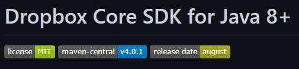
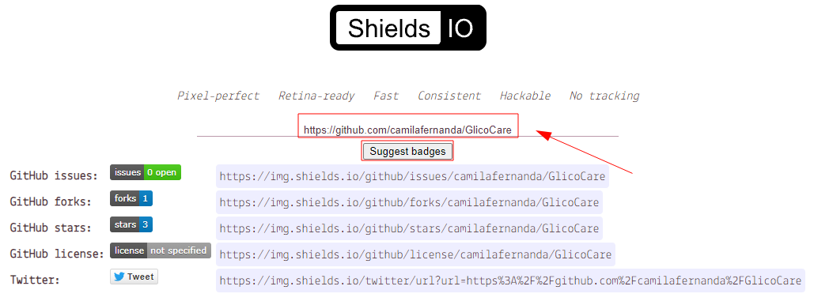
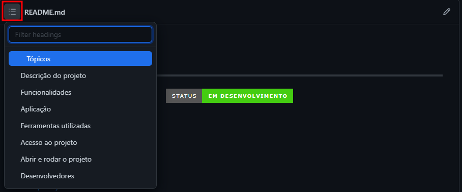
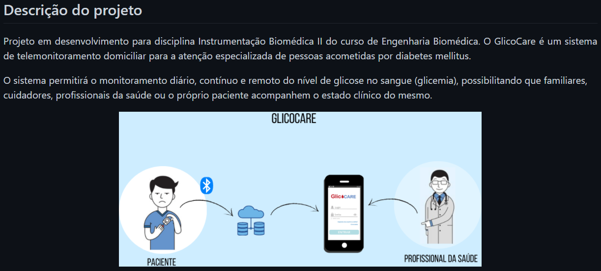
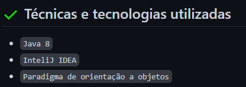
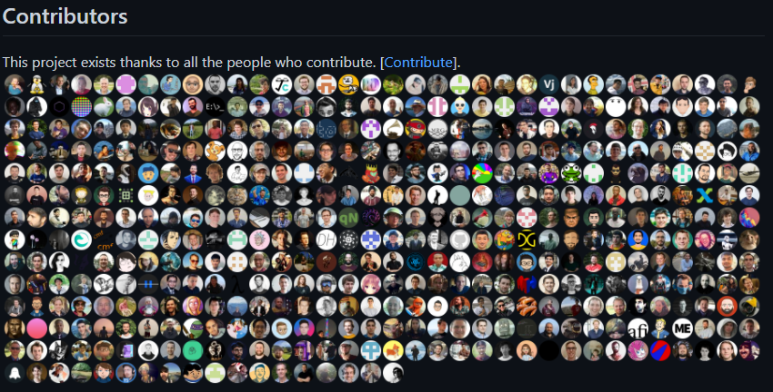
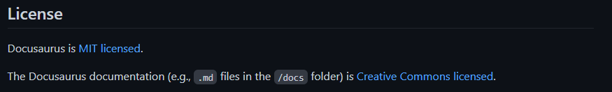

# Como escrever um README incrível no seu Github

Pasta criada apenas para conter as anotações do artigo escrito e fornecido pela Alura com dicas de como escrever um README.

Para acessar o artigo original clicar [neste link](https://www.alura.com.br/artigos/escrever-bom-readme)

## Índice

- [Como escrever um README incrível no seu Github](#como-escrever-um-readme-incrível-no-seu-github)
  - [Índice](#índice)
  - [O que é um README?](#o-que-é-um-readme)
  - [Por que fazer um README?](#por-que-fazer-um-readme)
  - [O que é bom ter em um README?](#o-que-é-bom-ter-em-um-readme)
  - [Título e Imagem de capa](#título-e-imagem-de-capa)
  - [Badges](#badges)
  - [Índice](#índice-1)
  - [Descrição do Projeto](#descrição-do-projeto)
  - [Status do Projeto](#status-do-projeto)
  - [Funcionalidades e Demonstração da Aplicação](#funcionalidades-e-demonstração-da-aplicação)
  - [Acesso ao projeto](#acesso-ao-projeto)
  - [Tecnologias utilizadas](#tecnologias-utilizadas)
  - [Pessoas Contribuidoras](#pessoas-contribuidoras)
  - [Licença](#licença)
  - [Referências de README](#referências-de-readme)

## O que é um README? 

O README é um arquivo com extensão .md, ou seja, ele é escrito em Markdown que é uma linguagem de marcação utilizada para converter o texto em um HTML válido. Caso queira saber mais sobre, temos esse artigo que explica muito bem como funciona e como escrever anotações com essa linguagem.

A função do README em um repositório é apresentar informações do projeto, como:

- Descrição do projeto;
- Funcionalidades;
- Como os usuários podem utilizá-los
- Onde os usuários podem encontrar ajuda sobre o projeto;
- Autores do projeto.

## Por que fazer um README?

É importante ter um README para `documentar o projeto`, assim quem for visitar ele, saberá do que se trata.

O README `é a porta de entrada do seu projeto`, é a primeira coisa que as pessoas vêem. Até o GitHub faz a recomendação de criar este arquivo quando ele não está criado.

Além disso, há muitos que usam o `GitHub como portfólio`, então ter um `README atraente` pode ser útil para chamar atenção.

## O que é bom ter em um README?

Alguns pontos em comum legais de se ter em README são:

- Título e imagem de capa;
- Badges;
- Índice;
- Descrição do projeto;
- Status do projeto;
- Funcionalidades e demonstração da aplicação;
- Acesso ao projeto;
- Tecnologias utilizadas;
- Pessoas contribuidoras;
- Pessoas desenvolvedoras do projeto;
- Licença utilizada;

## Título e Imagem de capa

Assim que você adicionar um README, ele já irá _iniciar com o título sendo o nome do seu repositório_. Mas você pode _mudar ele e colocar um nome descritivo_. Nesse momento abuse da criatividade.

Para colocar um título podemos usar os dois códigos abaixo:

```markdown
# Seu título aqui
```

Ou caso queira centralizar:

```markdown
<h1 align="center"> Seu título aqui </h1>
```

Feito isso, caso queira, você pode fazer uma __capa__ ou __logo do projeto__ para colocar após o título ou até substituí-lo.

## Badges

Alguns repositórios utilizam __badges__, que na tradução literal é distintivo, emblema ou insígnia. Seus objetivos são indicar o __estado atual do projeto, licença__ caso tenha, __versões, dependências, testes__ e entre outros.

Um exemplo do uso de badges em um repositório do Dropbox, o _Dropbox Core SDK for Java 8+_:



Nele foi usado para:

- __Licença__: Instituto de Tecnologia de Massachusetts (MIT);
- __Versão da ferramenta de gerenciamento de dependências Maven:__ versão 4.0.1;
- __Data da última versão do projeto:__ agosto

Caso queira fazer suas badges, você pode utilizar o [Shields.io](https://shields.io), ele fornece na página principal diversos exemplos de Badges e, além disso, nele você pode colar o link do seu repositório do GitHub na caixa de texto inicial, assim automaticamente ele irá sugerir algumas Badges para você utilizar no seu projeto, fornecendo o link da Badge para copiar e colar no seu README.



## Índice

O GitHub gera automaticamente um índice para arquivos README, tendo como base os títulos da seção. Para visualizá-lo, selecione o ícone de menu no canto superior esquerdo do arquivo.



## Descrição do Projeto

Como é um objetivo do arquivo README __descrever o projeto__, é legal que você apresente logo após o título ou imagem de capa e/ou Badges caso tenha, uma breve explicação do seu projeto com seu objetivo principal.

Você pode adotar uma descrição mais objetiva, como a do _Dropbox Core SDK for Java 8+_:


Ou pode detalhar mais, como feito no projeto GlicoCare e apresentar figuras que exemplificam o projeto, caso tenha:



## Status do Projeto

Caso você opte por não utilizar Badges sobre o status do projeto, é interessante que você coloque essa informação no próprio texto mesmo. Exemplo:

```markdown
> :construction: Projeto em construção :construction:
```

Resultado:

> :construction: Projeto em construção :construction:

## Funcionalidades e Demonstração da Aplicação

Você pode __listar as funcionalidades__ do seu projeto para facilitar o entendimento do usuário. Para isso, você pode fazer dessa maneira:

```markdown
# :hammer: Funcionalidades do projeto

- `Funcionalidade 1`: descrição da funcionalidade 1
- `Funcionalidade 2`: descrição da funcionalidade 2
- `Funcionalidade 2a`: descrição da funcionalidade 2a relacionada à funcionalidade 2
- `Funcionalidade 3`: descrição da funcionalidade 3
```

## Acesso ao projeto

Caso o seu projeto esteja no ar com algum serviço de hospedagem, você pode __disponibilizar o link__ para o mesmo. Caso contrário, você pode apostar em gifs e imagens, como citado anteriormente, bem como indicar como o usuário __pode baixar o projeto, abrir e executar__.

## Tecnologias utilizadas

Você também pode citar as __tecnologias utilizadas no projeto__, é uma ótima forma de demonstrar o que você anda estudando nesse mar que é a tecnologia.

Você pode citar com textos, como o que foi feito no repositório _Edige - POO_:



## Pessoas Contribuidoras

Caso o seu projeto tenha contribuidores, é bacana adicionar eles no README. Um exemplo fantástico disso é o Docusaurus, onde se tem as fotos de todos os contribuidores e um link para outro documento markdown com recados importantes para quem deseja contribuir também:



## Licença

Geralmente, os repositórios públicos no GitHub são utilizados para compartilhar softwares de código aberto. Porém, para que um repositório seja realmente de código aberto, ele precisa obter uma licença para que outros tenham a liberdade de usar, alterar e distribuir o software.

Portanto, caso seu repositório tenha uma licença, é essencial que você coloque ela no seu README. Como feito no Docusaurus:



## Referências de README

Abaixo algumas referências citadas acima:

- [Docusaurus](https://github.com/facebook/docusaurus/blob/main/README.md)
- [GlicoCare](https://github.com/camilafernanda/GlicoCare/blob/main/README.md)
- [CacheLib](https://github.com/facebook/CacheLib/blob/main/README.md)
- [Edige - POO](https://github.com/gui-lirasilva/Edige-POO/blob/master/README.md)

E para se inspirar, segue alguns templates legais:

- [Template de README em Português feito pela Diana Regina](https://gist.github.com/reginadiana/e044fe93ed81aa04a10361cb841c0409), que é um presente do artigo da autora, o qual foi referência para escrita desse;
- [Template de README em Inglês](https://github.com/othneildrew/Best-README-Template) do Othneil Drew.
