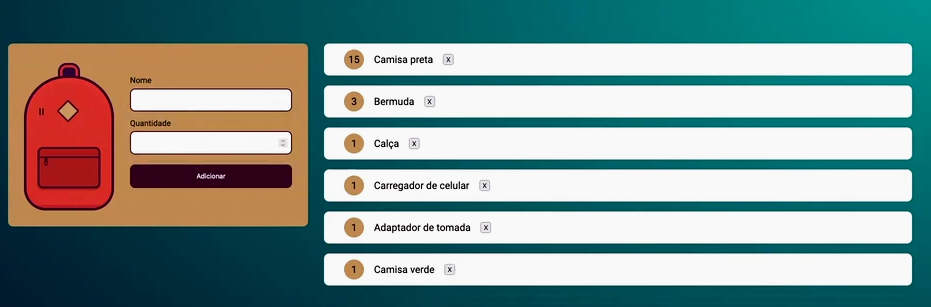

# JavaScript na Web: armazenando dados no navegador

Essa pasta / projeto foi criado para armazenar os conteúdos do curso de JavaScript da Alura. Nele vamos aprender a criar a lógica por trás de um site que armazena uma lista de itens que não podem ser esquecidos para uma viagem.

O HTML e CSS permanecerão os mesmos, no máximo com pequenas modificações. O foco do curso é o `JavaScript`.

## Índice

- [JavaScript na Web: armazenando dados no navegador](#javascript-na-web-armazenando-dados-no-navegador)
  - [Índice](#índice)
  - [Apresentação](#apresentação)
  - [Capturando os dados da tela](#capturando-os-dados-da-tela)
  - [Criando as validações](#criando-as-validações)
  - [O armazenamento na WEB](#o-armazenamento-na-web)
  - [Inserindo dados no LocalStorage](#inserindo-dados-no-localstorage)
  - [Múltiplos itens no localStorage](#múltiplos-itens-no-localstorage)
  - [Entendendo localStorage](#entendendo-localstorage)
  - [Consultando dados do LocalStorage](#consultando-dados-do-localstorage)
  - [Atualizar página ao cadastrar item](#atualizar-página-ao-cadastrar-item)
  - [Diferentes armazenadores de dados](#diferentes-armazenadores-de-dados)

## Apresentação

Vamos partir do ZERO do JS, aproveitando apenas o código HTML e CSS.

O projeto final deve ficar assim:



## Capturando os dados da tela

Incialmente adicionamos a pasta de CSS e arquivo index.html no projeto.

Após, podemos adicionar uma pasta chamada js para conter os códigos JavaScript. Linkar o `main.js` dentro do `html`.

Dando início ao código JavaScript podemos testar se a conexão funcionou usando o código abaixo que faz request do formulário do site:

```javascript
console.log(document.getElementById("novoItem"));
```

O código acima nos retorna o HTML do formulário no console do navegador. Após confirmar que deu tudo certo, podemos continuar o código.

No código abaixo estamos passando o código HTML do formulário para uma variável. Após isso, criamos um _event listenet_ para o botão de `submit` do formulário.

Ao ser clicado, esse botão redireciona para a própria página, portanto os dados se perdem se tentarmos imprimi-los via `console.log`. Dessa forma, é necessário adicionar um __"previnidor de ação default"__ para bloqueaar a ação default do botão `submit` com o código `evento.preventDefault()`.

Depois, acessamos o valor contido no campo `nome` e `quantidade` através da estrutura `evento -> target -> elements -> nome-do-elemento`.

Código:

```javascript
// Criando variável para armazenar o formulário
const form = document.getElementById("novoItem");

// Criando escutador de evento para ao clicar no "submit" printar no console "funcionou" 
form.addEventListener("submit", (evento) => {
    // Criando comando para previnir ação padrão do evento, que nesse caso seria o submit para a própria página, assim o console.log vai funcionar ao clicar no submit
    evento.preventDefault();
    
    // Imprimindo no console os dados dos campos nome e quantidade através da chave do elemento dentro do target do evento
    console.log(evento.target.elements["nome"].value);
    console.log(evento.target.elements["quantidade"].value);

})
```

## Criando as validações

Para facilitar a leitura das modificações, iniciamos a aula excluíndo alguns itens da lista de itens contida no HTML.

Após, começamos a complementar o código JS incluíndo a função `criaElemento()` para criação de elementos na tag HTML.

Nessa função, passamos como parâmetro o `nome` e `quantidade` que será preenchida no formulário.

Logo de cara, incluímos a função criada dentro do evento `submit` e passamos como parâmetro as informações pegas anteriormente.

Dentro da função, declaramos uma variável para conter a tag `li` que será a tag comportando o item novo, isso através do código `const novoItem = document.createElement("li")`.

Depois, adicionamos à esse elemento criado anteriormente a mesma classe dos seus irmãos, com o código `novoItem.classList.add("item")`.

Fazemos então o mesmo processo, criando agora a tag que contém a quantidade informada e fica dentro do elemento `strong`. Para passar o valor da quantidade para a tag, usamos a variável criada e usamos o método `innerHTML = quantidade`.

Após, adicionamos a tag com a quantidade dentro da tag pai com o código `novoItem.appendChild(numeroItem);`. Então adicionamos o `nome` à tag com um incremento.

Por fim, usamos a variável `lista` que foi criada no início do código contendo a __lista completa de itens__ para armazenar o conteúdo da variável `novoItem`.

Abaixo o código completo:

```javascript
// Criando variável para armazenar o acesso ao formulário
const form = document.getElementById("novoItem");

// Criando variável para armazenar o acesso à lista de itens
const lista = document.getElementById("lista");

// Criando escutador de evento para ao clicar no "submit" printar no console "funcionou" 
form.addEventListener("submit", (evento) => {
    // Criando comando para previnir ação padrão do evento, que nesse caso seria o submit para a própria página, assim o console.log vai funcionar ao clicar no submit
    evento.preventDefault();

    // PCriando variável para conter nome e quantidade preenchidos no formulário do site
    const nome = evento.target.elements["nome"].value;
    const quantidade = evento.target.elements["quantidade"].value;

    // Chamando função criaElemento toda vez que o botão submit for clicado e passando nome e quantidade
    criaElemento(nome, quantidade);

})

// Criando função que recebe nome e quantidade para criar um novo elemento
function criaElemento(nome, quantidade) {
    console.log(nome); // para testar se está imprimindo valor do nome
    console.log(quantidade); // para testar se está imprimindo valor da quantidade

    // Exemplo de tag item: <li class="item"><strong>7</strong>Camisas</li>

    // Criando variável para conter um novo "li" criado no html 
    const novoItem = document.createElement("li");
    // Atribuindo ao novo item criado a classe "item"
    novoItem.classList.add("item");

    // Criando variável para conter um novo elemento "strong" criado no html
    const numeroItem = document.createElement("strong");
    // Passando a quantidade informada no formulário para o valor dentro da tag html criada na variavel numeroItem (innerHTML -> passa valor para dentro da tag)
    numeroItem.innerHTML = quantidade;

    // Passando a variável numeroItem para dentro da novoItem via metodo appendChield (para comportar toda tag HTML, sem que seja adicionada como um objeto)
    novoItem.appendChild(numeroItem);
    // Agora adicionando a variável nome à variável novoItem via innerHTML, pois ela já está com a quantidade dentro da tag
    novoItem.innerHTML += nome;

    // Adicionando a variável novoItem à variável que contem toda a tag com a lista de itens
    lista.appendChild(novoItem);

    // Printando variável novoItem para confirmar se o innerHTML funcionou
    console.log(novoItem);
}
```

## O armazenamento na WEB

Para impedir a perda de informações após recarregar a página vamos aprender a usar o `local storage`, que é um espaço para armazenar as informações dentro do navegador do usuário.

Podemos verificar o `localStorage` via console do navegador usando o comando `console.log(localStorage)`. Ao usar esse comando vai vir uma dezena de informações que são objetos.

Para adicionar informações ao local storage podemos usar o comando `localStorage.setItem()`, mas por se tratar de um objeto precisamos passar a `chave` e o `valor` do item, ficado assim o código `localStorage.setItem("chave","valor")`.

Podemos usar o comando `localStorage.removeItem("chave")` para removê-lo do objeto.

Para fazer uma limpa geral no podemos usar o comando `localStorage.clear()`

Abaixo um código de exemplo que podemos usar no console:

```javascript
// Adicionando item ao localstorage
localStorage.setItem("curso", "Meu curso de JavaScript");

// Acessando informações adicionadas anteriormente de duas formas
localStorage.getItem("curso");
localStorage.curso;

// Removendo item cadastrado no localStorage
localStorage.removeItem("curso");

// Limpando todos os dados do localStorage
localStorage.clear();
```

## Inserindo dados no LocalStorage

Para fazer com que o código armazene as informações após a inclusão de itens na lista, podemos adicionar no fim da função `criaElemento` as linhas abaixo:

```javascript
  // Adicionando nome e quantidade no localStorage
    localStorage.setItem("nome", nome)
    localStorage.setItem("quantidade", quantidade);
```

Além disso, podemos adicionar ao `addEventListener` do submit 2 linhas que limpem o formulário após esse código ser executado:

```javascript
// Criando listener para o formulário
form.addEventListener("submit", (evento) => {
    // Impedindo reload da página submitar
    evento.preventDefault();

    // Criando variáveis para acessar campos de input
    const nome = evento.target.elements["nome"];
    const quantidade = evento.target.elements["quantidade"];

    // Chamando função para criar item na lista
    criaElemento(nome.value, quantidade.value);

    // Limpando formulário após submit
    nome.value = "";
    quantidade.value = "";

})
```

Dessa forma, o código final ficaria:

```javascript
// Criando variáveis de acesso ao DOM
const form = document.getElementById("novoItem");
const lista = document.getElementById("lista");

// Criando listener para o formulário
form.addEventListener("submit", (evento) => {
    // Impedindo reload da página submitar
    evento.preventDefault();

    // Criando variáveis para acessar campos de input
    const nome = evento.target.elements["nome"];
    const quantidade = evento.target.elements["quantidade"];

    // Chamando função para criar item na lista
    criaElemento(nome.value, quantidade.value);

    // Limpando formulário após submit
    nome.value = "";
    quantidade.value = "";

})

// Criando para criar novo elemento e incluir na lista
function criaElemento(nome, quantidade) {
    console.log(nome); // para testar se está imprimindo valor do nome
    console.log(quantidade); // para testar se está imprimindo valor da quantidade

    // Exemplo de tag item: <li class="item"><strong>7</strong>Camisas</li>

    // Declarando variável para criar "li"
    const novoItem = document.createElement("li");
    // Atribuindo à variável "li" a classe "item"
    novoItem.classList.add("item");

    // Declarando variável para criar o "strong"
    const numeroItem = document.createElement("strong");
    // Passando quantidade informada no formulário para variável do "strong"
    numeroItem.innerHTML = quantidade;

    // Adicionando à variável "li" a tag "strong"
    novoItem.appendChild(numeroItem);
    // Adicionando à variável "li" o valor do nome
    novoItem.innerHTML += nome;

    // Adicionando a tag "li" à tag "ul" (variável lista)
    lista.appendChild(novoItem);

    // Printando variável novoItem para confirmar se funcionou
    console.log(novoItem);

    // Adicionando nome e quantidade no localStorage
    localStorage.setItem("nome", nome)
    localStorage.setItem("quantidade", quantidade);
}
```

## Múltiplos itens no localStorage

O localStorage tem a particularidade de armazenar somente dados do tipo `string`. Dessa forma, como precisamos armazenar uma relação de itens com `nome` e `quantidade` para ser acessada depois, vamos precisar criar um objeto e converter ele em string com o método `JSON.stringify()`.

Porém, ao cadastrar um novo item, o item anterior é substituído no localStorage. Dessa forma, precisamos criar um `array` de escopo global para ser incrementado a cada vez que a função `criaElemento` for executada e adicionar esse `novo objeto de item` para o array criado.

Abaixo o código JS atualizado:

```javascript
// Criando variáveis de acesso ao DOM
const form = document.getElementById("novoItem");
const lista = document.getElementById("lista");

// Criando array para armazenar localStorage
const itens = [];

// Criando listener para o formulário
form.addEventListener("submit", (evento) => {
    // Impedindo reload da página submitar
    evento.preventDefault();

    // Criando variáveis para acessar campos de input
    const nome = evento.target.elements["nome"];
    const quantidade = evento.target.elements["quantidade"];

    // Chamando função para criar item na lista
    criaElemento(nome.value, quantidade.value);

    // Limpando formulário após submit
    nome.value = "";
    quantidade.value = "";

})

// Criando para criar novo elemento e incluir na lista
function criaElemento(nome, quantidade) {
    console.log(nome); // para testar se está imprimindo valor do nome
    console.log(quantidade); // para testar se está imprimindo valor da quantidade

    // Exemplo de tag item: <li class="item"><strong>7</strong>Camisas</li>

    // Declarando variável para criar "li"
    const novoItem = document.createElement("li");
    // Atribuindo à variável "li" a classe "item"
    novoItem.classList.add("item");

    // Declarando variável para criar o "strong"
    const numeroItem = document.createElement("strong");
    // Passando quantidade informada no formulário para variável do "strong"
    numeroItem.innerHTML = quantidade;

    // Adicionando à variável "li" a tag "strong"
    novoItem.appendChild(numeroItem);
    // Adicionando à variável "li" o valor do nome
    novoItem.innerHTML += nome;

    // Adicionando a tag "li" à tag "ul" (variável lista)
    lista.appendChild(novoItem);

    // Printando variável novoItem para confirmar se funcionou
    console.log(novoItem);

    // Criando objeto de item para adicionar ao localStorage
    const itemAtual = {
        "nome": nome,
        "quantidade": quantidade
    }

    // Adicionando objeto de itemAtual ao array de itens já cadastrados
    itens.push(itemAtual);

    // Adicionando array de objetos como string no localStorage
    localStorage.setItem("item", JSON.stringify(itens));
}
```

## Entendendo localStorage

Até aqui, vimos que localStorage armazena dados do tipo texto string e, para armazenar objetos, arrays, e listas, é preciso convertê-los utilizando o método JSON.stringify(). Já quando queremos acessar algum dado, podemos utilizar o método localStorage.getItem().

> Os tipos de dados armazenados no localStorage não devem ser considerados sensíveis, de acordo com a LGPD (Lei Geral de Proteção de Dados). Isso ocorre, pois ele não possui nenhuma camada de proteção, e os dados podem ser acessados facilmente por terceiros. Dados considerados sensíveis, devem ser armazenados em Cookies.

## Consultando dados do LocalStorage

Para consultar os itens salvos no localStorage precisamos modificar o array onde os itens estão sendo armazenados ao dar `submit` no formulário.

Na criação do array vamos converter a `string` contida nele, parseando um objeto `JSON`.

Depois disso usamos o `forEach` para imprimir na tela todos os itens existentes dentro do `localStorage`.

Abaixo o código ajustado:

```javascript
// Criando variáveis de acesso ao DOM
const form = document.getElementById("novoItem");
const lista = document.getElementById("lista");

// Criando array com os itens do localStorage parseados ou vazio se o localStorage não tiver itens
const itens = JSON.parse(localStorage.getItem("itens")) || [];

// Imprimindo nome e quantidade de cada iten no localStorage
itens.forEach((item) => {
    console.log(item.nome, item.quantidade);
});

// Criando listener para o formulário
form.addEventListener("submit", (evento) => {
    // Impedindo reload da página submitar
    evento.preventDefault();

    // Criando variáveis para acessar campos de input
    const nome = evento.target.elements["nome"];
    const quantidade = evento.target.elements["quantidade"];

    // Chamando função para criar item na lista
    criaElemento(nome.value, quantidade.value);

    // Limpando formulário após submit
    nome.value = "";
    quantidade.value = "";

})

// Criando para criar novo elemento e incluir na lista
function criaElemento(nome, quantidade) {
    // Exemplo de tag item: <li class="item"><strong>7</strong>Camisas</li>

    // Declarando variável para criar "li"
    const novoItem = document.createElement("li");
    // Atribuindo à variável "li" a classe "item"
    novoItem.classList.add("item");

    // Declarando variável para criar o "strong"
    const numeroItem = document.createElement("strong");
    // Passando quantidade informada no formulário para variável do "strong"
    numeroItem.innerHTML = quantidade;

    // Adicionando à variável "li" a tag "strong"
    novoItem.appendChild(numeroItem);
    // Adicionando à variável "li" o valor do nome
    novoItem.innerHTML += nome;

    // Adicionando a tag "li" à tag "ul" (variável lista)
    lista.appendChild(novoItem);

    // Criando objeto de item para adicionar ao localStorage
    const itemAtual = {
        "nome": nome,
        "quantidade": quantidade
    }

    // Adicionando objeto de itemAtual ao array de itens já cadastrados
    itens.push(itemAtual);

    // Adicionando array de objetos como string no localStorage
    localStorage.setItem("itens", JSON.stringify(itens));
}
```

## Atualizar página ao cadastrar item

Ao criar fazer as modificações anteriores acabamos gerando um problema no código, pois se tentarmos adicionar os itens salvos no localStorage na tag HTML, eles serão duplicados, já que a adição ao localStorage está dentro da função `criaElemento`.

Para corrigir o problema basta substituir o local do código que adiciona itens ao localStorage. Ao invés de ficar na função `criaElemento`, podemos passar o código para o `listener` do botão `submit`. Dessa forma, toda vez que `submitarmos` um novo item, ele será adicionado ao local storage.

Porém, precisamos fazer um pequeno ajuste na função `criaElemento` que está recebendo 2 parâmetros. A partir de agora ela receberá o `objeto` criado para armazenar as informações do item.

Por fim, ajustamos o `forEach` no início do código para chamar a função `criaElemento` para cada elemento dentro do `localStorage`.

Abaixo o código ajustado:

```javascript
// Criando variáveis de acesso ao DOM
const form = document.getElementById("novoItem");
const lista = document.getElementById("lista");

// Criando array com os itens do localStorage parseados ou vazio se o localStorage não tiver itens
const itens = JSON.parse(localStorage.getItem("itens")) || [];

// Laço para criar elemento com dados do localstorage
itens.forEach((item) => {
    console.log(item); // Printando no console
    criaElemento(item); // Criando elementos
});

// Criando listener para o formulário
form.addEventListener("submit", (evento) => {
    // Impedindo reload da página submitar
    evento.preventDefault();

    // Criando variáveis para acessar campos de input
    const nome = evento.target.elements["nome"];
    const quantidade = evento.target.elements["quantidade"];

    // Criando objeto de item para adicionar valores ao localStorage
    const itemAtual = {
        "nome": nome.value,
        "quantidade": quantidade.value
    }

    // Chamando função para criar item na lista
    criaElemento(itemAtual);

    // Adicionando objeto de itemAtual ao array de itens já cadastrados
    itens.push(itemAtual);

    // Adicionando array de objetos como string no localStorage
    localStorage.setItem("itens", JSON.stringify(itens));

    // Limpando formulário após submit
    nome.value = "";
    quantidade.value = "";

})

// Criando função para criar novo elemento e incluir na lista
function criaElemento(item) {
    // Exemplo de tag item: <li class="item"><strong>7</strong>Camisas</li>

    // Declarando variável para criar "li"
    const novoItem = document.createElement("li");
    // Atribuindo à variável "li" a classe "item"
    novoItem.classList.add("item");

    // Declarando variável para criar o "strong"
    const numeroItem = document.createElement("strong");
    // Passando quantidade informada no formulário para variável do "strong"
    numeroItem.innerHTML = item.quantidade;

    // Adicionando à variável "li" a tag "strong"
    novoItem.appendChild(numeroItem);
    // Adicionando à variável "li" o valor do nome
    novoItem.innerHTML += item.nome;

    // Adicionando a tag "li" à tag "ul" (variável lista)
    lista.appendChild(novoItem);

}
```

## Diferentes armazenadores de dados

Cookies, localStorage e sessionStorage são formas de armazenar dados no navegador, porém existem diferenças na usabilidade de cada um. Vamos conferir estas diferenças abaixo:

**localStorage** guarda informações de forma persistente no navegador, sendo em média 5MB de armazenamento padrão, podendo variar dependendo do navegador utilizado. Este limite pode ser aumentado pelo usuário quando necessário, no entanto apenas alguns navegadores suportam isso. Os dados salvos são apenas do tipo string texto.

**Cookies** guardam informações de forma persistente no navegador, sendo até 4KB de armazenamento por Cookie, bem menos que localStorage. Cada cookie é como se fosse um arquivo criado que guarda as informações de acesso da pessoa usuária, por exemplo, de qual local o site foi acessado, qual e-mail foi utilizado ao realizar login no navegador, e quais produtos de um site foram clicados. Para acessá-los, muitas empresas criam pop ups para confirmar a autorização do uso dessas informações, pois são consideradas sensíveis.

**sessionStorage** é similar ao localStorage, sua diferença é que os dados não são salvos de forma persistente, ou seja, ao fechar o navegador eles são perdidos. Este tipo de armazenamento é utilizado quando queremos que a pessoa usuária utilize os dados apenas enquanto estiver com o site aberto.
