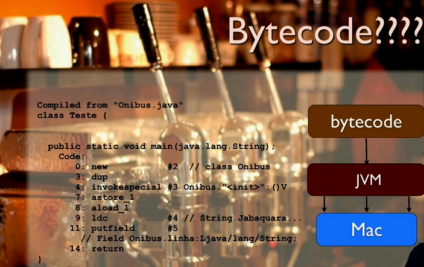

# Java JRE e JDK: compile e execute o seu programa

Nesse curso vamos aprender a compilar os primeiros códigos em Java, percorrendo conceitos iniciais da linguagem como algumas bibliotecas e sua sintaxe básica.

## Índice

- [Java JRE e JDK: compile e execute o seu programa](#java-jre-e-jdk-compile-e-execute-o-seu-programa)
  - [Índice](#índice)
  - [A plataforma Java](#a-plataforma-java)
  - [Mão na massa: instalando o JDK](#mão-na-massa-instalando-o-jdk)

## A plataforma Java

A principal diferença da Java para outras linguagens é a sua __plataforma__ e não a sua linguagem, pois a plataforma traz muitas facilidades.

A plataforma Java surgiu na __Sun Microsystems__, pois naquela época cada aparelho tinha uma linguagem própria para se programar (game, vhs, tv, etc).

A ideia da Sun que era uma empresa focada em hardware foi criar um único código que gerasse um executavel que fosse interpretado por uma __Máquina Virtual__, mas a ideia fracassou, pois dependia de uma fabricação em grande escala de chips que funcionassem como esse interpretador.

Com o surgimento e competição de navegadores essa ideia veio à tona novamente, daí então desenvolveram a __JVM (Java Virtual Machine)__ que funciona quase como um interpretador (mas não exatamente) e realiza a tradução para o aparelho específico.

;

## Mão na massa: instalando o JDK

Passo 1: No Linux, primeiramente vamos ter que executar o seguinte comando no terminal:

`sudo apt update`

Passo 2: Feito isso, agora vamos instalar a versão 17 do JDK, que hoje é a mais recente, para isso, vamos executar o seguinte comando no terminal:

`sudo apt install openjdk-17-jdk`

Caso queira, você poderá instalar uma versão mais antiga do JDK, você só terá que mudar o número da versão que fica entre openjdk- e -jdk, por exemplo, você pode instalar a versão 11 com: openjdk-11-jdk e a versão 8 com: openjdk-8-jdk, mas recomendamos que você instale a versão mais recente, no caso, a versão 17.

Passo 3: Terminado o processo de instalação, chegou a hora de configurar a variável de ambiente JAVA_HOME, que é utilizada para indicar o caminho de instalação do JDK. Em uma tradução literal seria o “lar do java” e ela será necessária para utilizarmos os recursos do JDK como o javac. Para isso, execute o comando `sudo update-alternatives --config` java que mostrará o caminho onde o JDK foi instalado. O resultado será parecido ou igual a esse:

Agora, copie esse caminho até /bin, por exemplo: `/usr/lib/jvm/java-17-openjdk-amd64/bin` e digite no seu terminal o comando: `export JAVA_HOME=`, sendo que após o sinal de igual, sem deixar espaços, cole o caminho que você copiou da instalação do JDK. Por exemplo:

`export JAVA_HOME=/usr/lib/jvm/java-17-openjdk-amd64/bin`

Pressione `enter` e pronto, seu JDK está instalado e configurado. Para testá-lo, digite os seguintes comandos no terminal:

`javac -version`
`java -version`
