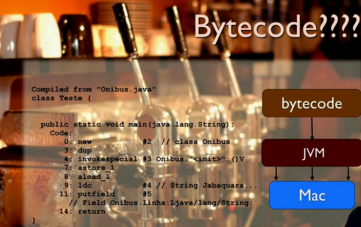
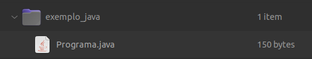
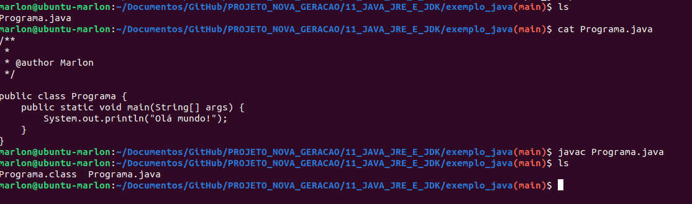
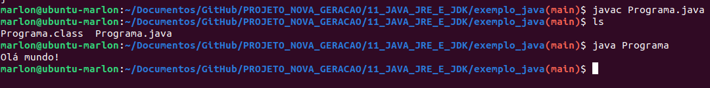
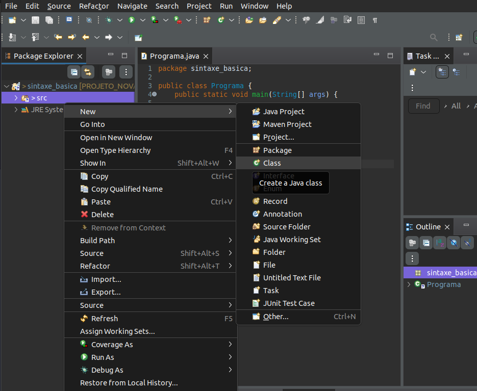

# Java JRE e JDK: compile e execute o seu programa

Nesse curso vamos aprender a compilar os primeiros códigos em Java, percorrendo conceitos iniciais da linguagem como algumas bibliotecas e sua sintaxe básica.

## Índice

- [Java JRE e JDK: compile e execute o seu programa](#java-jre-e-jdk-compile-e-execute-o-seu-programa)
  - [Índice](#índice)
  - [A plataforma Java](#a-plataforma-java)
  - [Mão na massa: instalando o JDK](#mão-na-massa-instalando-o-jdk)
  - [Compile e rode seu primeiro programa Java](#compile-e-rode-seu-primeiro-programa-java)
  - [Nosso programa rodando no Eclipse](#nosso-programa-rodando-no-eclipse)
  - [Tipo inteiro: int](#tipo-inteiro-int)
  - [Tipo flutuante: double](#tipo-flutuante-double)
  - [Conversões e outros tipos](#conversões-e-outros-tipos)
  - [Char e String](#char-e-string)
    - [Testes com if](#testes-com-if)
    - [Boolean condicionais](#boolean-condicionais)

## A plataforma Java

A principal diferença da Java para outras linguagens é a sua __plataforma__ e não a sua linguagem, pois a plataforma traz muitas facilidades.

A plataforma Java surgiu na __Sun Microsystems__, pois naquela época cada aparelho tinha uma linguagem própria para se programar (game, vhs, tv, etc).

A ideia da Sun que era uma empresa focada em hardware foi criar um único código que gerasse um executavel que fosse interpretado por uma __Máquina Virtual__, mas a ideia fracassou, pois dependia de uma fabricação em grande escala de chips que funcionassem como esse interpretador.

Com o surgimento e competição de navegadores essa ideia veio à tona novamente, daí então desenvolveram a __JVM (Java Virtual Machine)__ que funciona quase como um interpretador (mas não exatamente) e realiza a tradução para o aparelho específico.

;

## Mão na massa: instalando o JDK

Passo 1: No Linux, primeiramente vamos ter que executar o seguinte comando no terminal:

`sudo apt update`

Passo 2: Feito isso, agora vamos instalar a versão 17 do JDK, que hoje é a mais recente, para isso, vamos executar o seguinte comando no terminal:

`sudo apt install openjdk-17-jdk`

Caso queira, você poderá instalar uma versão mais antiga do JDK, você só terá que mudar o número da versão que fica entre openjdk- e -jdk, por exemplo, você pode instalar a versão 11 com: openjdk-11-jdk e a versão 8 com: openjdk-8-jdk, mas recomendamos que você instale a versão mais recente, no caso, a versão 17.

Passo 3: Terminado o processo de instalação, chegou a hora de configurar a variável de ambiente JAVA_HOME, que é utilizada para indicar o caminho de instalação do JDK. Em uma tradução literal seria o “lar do java” e ela será necessária para utilizarmos os recursos do JDK como o javac. Para isso, execute o comando `sudo update-alternatives --config` java que mostrará o caminho onde o JDK foi instalado. O resultado será parecido ou igual a esse:


Agora, copie esse caminho até /bin, por exemplo: `/usr/lib/jvm/java-17-openjdk-amd64/bin` e digite no seu terminal o comando: `export JAVA_HOME=`, sendo que após o sinal de igual, sem deixar espaços, cole o caminho que você copiou da instalação do JDK. Por exemplo:

`export JAVA_HOME=/usr/lib/jvm/java-17-openjdk-amd64/bin`

Pressione `enter` e pronto, seu JDK está instalado e configurado. Para testá-lo, digite os seguintes comandos no terminal:

`javac -version`
`java -version`

## Compile e rode seu primeiro programa Java

Para realizar o primeiro código em Java podemos criar um arquivo em um editor de texto qualquer com o código abaixo:

```java
public class Programa {
    public static void main(String[] args) {
        System.out.println("Olá mundo!");
    }
}
```

Alguns detalhes sobre o código acima é que todo código Java precisa estar dentro de um bloco de código chamado __classe__ e para realizar um __System.out.println__ é necessário que esse código esteja dentro de um método, que no código acima é o `main`.

Para que possamos compilar o código Java precisamos salvar o arquivo com o mesmo nome da __classe principal__ que nesse caso é Programa e esse arquivo precisa ter a extensão __.java__, como no exemplo abaixo:



A JVM não consegue interpretar um código com extensão __.java__, então para que possamos executá-lo é necessário primeiro compilar, para isso podemos usar o comando __javac__ no arquivo dentro do terminal. Após executar esse comando, o Java irá criar um arquivo __.class__ que agora sim poderá ser interpretado pelo JVM. Abaixo o exemplo:



Após isso tudo podemos usar o comando `java` para executar diretamente a __classe__ criada dentro do arquivo, ou seja, não passamos a extensão dele.

Abaixo o exemplo:



## Nosso programa rodando no Eclipse

Para o curso vamos usar a IDE Ecplipse. Para baixá-la basta acessar o site oficial e fazer download. No caso do Linux é necessário descompactar o arquivo e executar o __eclipse-inst__.

Após instalado, podemos ir em __File -> new -> java project__. Podemos usar todas as configurações automáticas que a IDE sugerir.

Após, acessamos a pasta __src__ dentro do projeto e clicamos com o botão direito para selecionar __new -> class__, como na imagem abaixo:



## Tipo inteiro: int

No Java as variáveis são fortemente tipadas, ou seja, é necessário declarar o tipo de variável ao criá-la.

Abaixo um exemplo de código:

```java
package sintaxe_variaveis_e_fluxo;

public class TestaVariaveis {
  public static void main(String[] args) {
    // Printando mensagem
    System.out.println("Olá novo teste");
    
    // Declarando variável idade, fortemente tipada
    int idade;
    idade = 37;
    
    // Printando variável idade
    System.out.println(idade);
    
    
  }
}
```

Outro detalhe da linguagem é a convenção na criação de __métodos e variáveis__. Ambos são criados com base na estrutura de __camelCase__ onde a primeira letra de cada palavra é maiúscula.

No caso de __classes e métodos a primeira letra é sempre maiúscula__, mas no caso de __variáveis a primeira letra é minúscula__.

Outro detalhe de boas práticas é sobre o nome de variáveis que em Java não costumam ser abreviados, ou seja, ao invés de uma variável _valMaxSal_ para representar o "valor máximo de salário", a variável deve ter o nome de _valorMaximoSalario_ ou algo parecido.

Para concatenar elementos usamos o operador de adição.

Abaixo um exemplo:

```java
package sintaxe_variaveis_e_fluxo;

public class TestaVariaveis {
 public static void main(String[] args) {
  // Printando mensagem
  System.out.println("Olá novo teste");

  // Declarando variável idade, fortemente tipada
  int idade;
  idade = 37;

  // Printando variável idade
  System.out.println(idade);

  // Concatenando string com idade
  System.out.println("A idade é: " + idade);

 }
}
```

## Tipo flutuante: double

No Java para trabalhar com _ponto flutuante_ precisamos usar variáveis do tipo `double`.

Esse tipo de variável possui algumas particularidades, por exemplo, ao tentar atribuir à uma variável _double_ o resultado de uma divisão de _2 inteiros_, ela vai armazenar o resultado __inteiro__ da divisão.

> Para contornar isso podemos atribuir à um dos valores da divisão um número com ponto flutuante, assim o Java converte o resultado do cálculo para o tipo mais abrangente

Outro detalhe mais geral na criação de variáveis é que em Java não há o conceito de _hoisting_, ou seja, não conseguimos usar uma variável antes dela ter sido declarada.

Abaixo um código de exemplos:

```java
package sintaxe_variaveis_e_fluxo;

public class TestaPontoFlutuante {
    public static void main(String[] args) {
      // Criando variável do tipo double
      double salario;
      salario = 1250.70;

      // Printando variável com texto
      System.out.println("Meu salário é: " + salario);

      // O código abaixo funcionaria, pois a variável idade foi criada mais abaixo
      // System.out.println("Minha idade é: " + idade);

      // Adicionando um número inteiro à variável double
      double idade = 23;
      System.out.println("Minha idade é: " + idade);

      // Ao tentar adicionar 0.0 em variável int ele não aceita
      // int valor = 0.0;

      // Fazendo contas com double
      double divisao = 3.14 / 2;
      System.out.println("O resultado é: " + divisao);

      // Dividindo 2 inteiros para demonstrar resultado
      int outraDivisao = 5 / 2; // Retorna 2
      System.out.println("O resultado é: " + outraDivisao);

      // Atribuindo mesma divisão para 2 inteiros
      double novaTentativa = 5 / 2; // Retorna 2.0
      System.out.println("O novo resultado: " + novaTentativa);

      // Atribuindo mesma divisão, agora 1 sendo double
      double maisUmaTentativa = 5.0 / 2; // Retorna 2.5
      System.out.println("O novo resultado: " + novaTentativa);
    }

}

```

## Conversões e outros tipos

Para converter um tipo em outro usamos o código abaixo:

```java
package sintaxe_variaveis_e_fluxo;

public class TestaConversao {
    
    public static void main(String[] args) {
      // Declarado variável double
      double salario = 1270.50;
      
      // Ao tentar atribuir double à int java não aceita
      // int valor = salario;
      
      // Convertendo double em int com o casting
      int valor = (int) salario;
      
      // Printando
      System.out.println("Variável int: " + valor);
    }
}
```

Porém, ao converter um _double_ para _int_ como no exemplo acima, acabamos perdendo informações após o ponto. No caso de _int_ para _double_ podemos apenas atribuir o valor, pois no Java isso é visto como uma _promoção_, como se o __int estivesse sendo promovido à double__.

Abaixo um código com mais uns exemplos:

```javascript
package sintaxe_variaveis_e_fluxo;

public class TestaConversao {
    
    public static void main(String[] args) {
      // Declarado variável double
      double salario = 1270.50;
      
      // Ao tentar atribuir double à int java não aceita
      // int valor = salario;
      
      // Convertendo double em int com o casting
      int valor = (int) salario;
      
      // Printando
      System.out.println("Variável int: " + valor);
      
      // -----------------------------------------
      
      // Outras variáveis do tipo numérico
      
      // Int suporta até 32 bits, ou seja, número 2000000
      int numeroNormal = 11411441;
      
      // long suporta valores muito maiores
      long numeroGrande = 131414441l;
      
      // short armazena menores ainda, até 16 bits, 32000
      short valorPequeno = 1313;
      
      //  byte armazena menor ainda, até 127
      byte numeroMuitoPequeno = 120;
      
      // float é outro ponto flutuante, mas parecido com long é
      // necessário colocar f no fim da declaração
      float numeroFlutuante = 3.14f; 
      
      // ------------------------------------
      
      // double não costumam ser usados para cálculo matemático
      // abaixo um exemplo do motivo
      
      double valor1 = 0.1;
      double valor2 = 0.2;
      double valorSoma = valor1 + valor2;
      System.out.println("Resultado da soma: " + valorSoma); // Retorna 0.30000000000000004
    }

}
```

## Char e String

__Char__ é um tipo de variável que armazena __um unicode de 16 bits__, ou seja, equivale a mais ou menos um caractere. Chars podem ser representados por __valores numéricos__, mas não são comparaveis à inteiros. Devem sempre ser declaradas com __aspas simples__.

Por exemplo, ao criar uma variável do tipo __char__ e tentar atribuir à ela o resultado de uma soma de __char__ com __int__, o Java não compila. Isso ocorre pois o resultado de uma operação assim é um __int__ (no Java o "tipo maior" sempre tem preferência) e um __char não armazena um int__, mas um __int pode armazenar um char__.

Abaixo um exemplo:

```java
package sintaxe_variaveis_e_fluxo;

public class TestaCaracteres {
    public static void main(String[] args) {
    // Declarando variável de caractere pequena 
    // que armazena apenas 1 caractere de 16 bits
        
    // Usamos aspas simples ao criar
    char letra = 'a';
    
    // Printando a letra criada
    System.out.println(letra);
    
    // Um char pode ser representado por um código numérico
    char valor = 66;
    
    // Printando o valor criado
    System.out.println(valor);
    
    // Ao tentar somar 1 ao char, o java não permite
    // pois ele executa a operação e atribui à variável com 
    // tipo maior
    
    // valor = valor +1; // O resultado é um inteiro (por ser maior) tentando caber num char, o que da erro
    valor = (char) (valor + 1); // Estamos forçando o resultado da operação a ser um char
      
    // Printando resultado da soma
    System.out.println(valor);
    }

}

```

Uma __String__ é um pouco diferente dos outros tipos criados até o momento que armazenam valores, pois Strings são do tipo referência (podemos ver por ela ser declarada com a __primeira letra maiúscula__). Isso ocorre pois __Strings__ são objetos que permitem operações especiais.

Strings devem obrigatoriamente ser criadas com __aspas duplas__. Podemos declarar Strings vazias, o que diferencia de __char__.

Abaixo exemplos:

```java
package sintaxe_variaveis_e_fluxo;

public class TestaCaracteres {
    public static void main(String[] args) {
   
    
    // ------------------------
    
    // Strings são como objetos e são tipo referência
    
    String palavra = "meu exemplo de String Java";
    
    // Podemos declarar Strings vazias, mas char não
    String palavraVazia = "";
    
    // Printando palavras criadas
    System.out.println(palavra);
    
    // A concatenação de Strings no Java é com o operador +
    System.out.println(palavra + " exemplo de concatenação");
    
    }
    
}
```

### Testes com if

No Java como em diversas linguagens temos funções comparadoras, umad elas é o __if__.

Existem alguns detalhes sobre o operador if em Java que precisam ser levadas em conta, por exemplo, é exigido que a condição __sempre esteja dentro de parenteses__.

O Java permite que o __if__ não contenha "{}" no caso de a resposta ser de apenas uma linha, mas por boas práticas é bom utilizar "{}" mesmo assim.

Abaixo um exemplo:

```java
package sintaxe_variaveis_e_fluxo;

public class TestaCondicional {
    public static void main(String[] args) {
      System.out.println("Códico para testar condicionais");

      // Criando variavel idade
      int idade = 20;
      int quantidadePessoas = 3;

      // Utilizando operador if
      if (idade >= 18) {
        System.out.println("Você tem mais que 18 anos!");
        System.out.println("Seja bem vindo!");
      } else { // utilizando else
        if (quantidadePessoas > 1) { // outro if dentro do else
          System.out.println("Você pode entrar por estar acompanhado!");
        } else {
          System.out.println("Infelizmente você não pode entrar!");
        }
      }

    }
}

```

### Boolean condicionais

No Java não temos um comando or que sirva como operador condicional, então para realizar um or utilizamos o __||__, conforme código abaixo:

```java
package sintaxe_variaveis_e_fluxo;

public class TestaCondicional2 {
    public static void main(String[] args) {
        // Criando variavel idade
        int idade = 20;
        int quantidadePessoas = 3;

        // Utilizando operador if com or
        if (idade >= 18 || quantidadePessoas > 1) {
          System.out.println("Você pode entrar!");
          System.out.println("Seja bem vindo!");
        } else { // utilizando else
          System.out.println("Infelizmente você não pode entrar!");
        }

    }
}

```

A mesma regra de or se espelha no comparador and. Para utilizar um comparador and usamos __&&__.

Abaixo um exemplo:

```java
package sintaxe_variaveis_e_fluxo;

public class TestaCondicional2 {
    public static void main(String[] args) {
      // Criando variavel idade
      int idade = 20;
      int quantidadePessoas = 3;

      // ------------------------
      // Utilizando operador if com and
      if (idade >= 18 && quantidadePessoas > 1) {
        System.out.println("Você pode entrar!");
        System.out.println("Seja bem vindo!");
      } else { // utilizando else
        System.out.println("Infelizmente você não pode entrar!");
      }

    }
}

```

Outro tipo padrão do Java é o boolean que armazena apenas __true__ ou __false__ dentro de suas variáveis. Ao usar uma variável do tipo boolean em um if, por exemplo, não tem necessidade de realizar uma comparação com o __==__, pois a própria variável armazena o resultando como true ou false.

Abaixo um exemplo:

```java
package sintaxe_variaveis_e_fluxo;

public class TestaCondicional2 {
    public static void main(String[] args) {
      // Criando variavel idade
      int idade = 20;
      int quantidadePessoas = 3;
      boolean acompanhado = true;

      // Utilizando if com operador boolean
      if (idade >= 18 && acompanhado) {
        System.out.println("Você pode entrar!");
        System.out.println("Seja bem vindo!");
      } else { // utilizando else
        System.out.println("Infelizmente você não pode entrar!");
      }
    }
}

```
